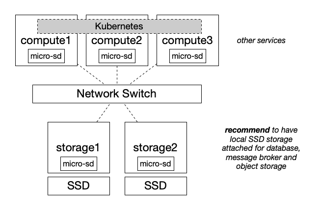
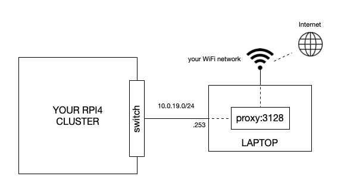

# RPI4 Private Cloud

A microk8s based private cloud provisioned with docker registry, psql, git, argo workflow+cd, concourse and kubeseal.

## Goal

Build a secure, private cloud, build from the ground up based upon a set of Raspberry Pi 4 modules, in order to have a solid bases to develop, deploy and operationalise a set of (Golang) based microservices & streaming apps to create a series of tutorials demonstrating cloud native software development.

## What are you going to get?

This repository provisions a (minimum) set of 5 Raspberry Pi4 (8Gb) nodes within the following deployment architecture:

The logic in this repository implements:

* **Base infrastructure**
  * Linux - [Ubuntu v22.04](https://releases.ubuntu.com/22.04/)
    * Kernel tuning (c-groups) & firmware configuration
    * Generate TLS Certificates (wildcards) for HTTPS based services
  * Proxy services & setup of clients
  * NTP services incl. sync over HTTP proxy & setup of clients 
  * DNS services & setup of clients
* **Container management**
  * Kubernetes cluster - [Microk8s](https://microk8s.io/)
  * Kubernetes secrets management - [Sealed Secrets](https://github.com/bitnami-labs/sealed-secrets)
  * Kubernetes object storage - [Minio](https://min.io/)
  * Local Docker registry - [Registry service](https://hub.docker.com/_/registry) and [Registry UI](https://hub.docker.com/r/joxit/docker-registry-ui)
* **Middleware**
  * Database - [TiDB - a cloud native distributed, MySQL compatible DB](https://www.postgresql.org/)
  * Message broker - [NATS](https://nats.io/) 
  * Workflow engine - [Argo Workflows](https://argoproj.github.io/workflows/)
  * OAuth2 / OIDC provider - [Ory Hydra](https://www.ory.sh/federated-identity-management/)
  * Identity server - [Ory Kratos](https://www.ory.sh/identity-authentication/)
* **Operations**
  * Host based monitoring - [Glances](https://nicolargo.github.io/glances/)
  * Container management - [Kubernetes Dashboard](https://github.com/kubernetes/dashboard) 
  * Tracing, logging, metrics - [Uptrace](https://uptrace.dev/)
* **Software Development Life Cycle**
  * Git repository service - [Gogs](https://gogs.io/)
  * Continuous integration - [Concourse CI](https://concourse-ci.org/)
  * Continuous deployment - [Argo CD](https://argoproj.github.io/cd/) and [Argo Rollouts](https://argoproj.github.io/rollouts/)

## Prerequisites

In order to avoid installing on your local machine the magnitude of utilities and avoid conflicts with versions nearly all logic will be executed in a [Docker](./Dockerfile) container.

You need only a limited set of software pre-installed on your local machine: 

* `Docker` & `docker-compose` (any recent version will do)

### Proxy node

The RPI4 Private Cloud will be deployed air-gapped from the Internet - as this is a common pattern for most secure environments; therefore you need to setup a proxy server listening on port `3128` on your local machine which itself should be connected directly to the switch of the RPI cluster with network address `10.0.19.253/24` - see below a logical overview:

> **Note**: this external proxy **is required for initial setup / updates** but the RPI cluster is operational without Internet connectivity once installed.

## Guide

Some tips / tricks worth knowing about 

XXXX

### Getting started

This step initializes your project on your laptop, installs the required CLIs & tools, downloads, configures & flashes the Ubuntu images to the micro-sd cards and performs all the steps as listed under "Base infrastructure". 

1. Clone this repository
2. Initialize your project using `task setup:init`
3. Flash your micro-sd cards for compute and storage nodes using `sudo task setup:flash COMPUTE_NODE=1`, `sudo task setup:flash STORAGE_NODE=1`, etc.
4. Install the cards into the Raspberry Pi modules
5. Connect your laptop to the RPI4 Private Cloud switch using the IP address `10.0.19.253` with netmask `255.255.255.0`, no gateway. 
6. Make sure [Proxyman](https://proxyman.io/) is up and running on your laptop.
7. Power on the RPI cluster 
   * **Note**: the very first time the cluster boots it may take up to *10 minutes before ready* due to the initialization scripts - advised is to wait before continuing with the next steps
8. Test the connectivity and configuration using `task network:ping`
9. Deploy network services, updates and generic OS system settings using `task setup:netsvc`
10. Reboot the cluster to pick up all settings and updates `task util:reboot`
11. Initialize the SSD disks using `task setup:ssd`
12. Configure your laptop DNS by running `task network:dnsmasq`
   * **Note**: if the task hangs, comment out the section `[ssh_connection]` in `./work/ansible.cfg`
   * **Test**: `ping ntp.tekqube.lan`
   * **Don't forget**: to enable the section `[ssh_connection]`
13. Generate the CA and keys/certificates for your cluster using `task setup:ingress-tls`

> **NOTE**: import the `TekQube CA` into your keychain before continuing, see  `task setup:ingress-tls --summary` for details.

1.   Deploy the Raspberry Pi optimized Kubernetes cluster [Microk8s](https://microk8s.io/) using `task setup:micro-k8s`
     * Set the environment variable `export KUBECONFIG=$(pwd)/work/tekqube-k8s-client.config`  in order to use `kubectl` from your laptop connecting securely to the cluster
2.   Deploy the central database and its management interface by running `task setup:postgresql` - this is a required and shared component for Git, Concourse, Core and Digital.

### Deploy the GitOps toolchain

Deploy the following components to install a GitOps enabled and code secured Kubernetes cluster ready to implement the best practices for the CI-CD pipelines required by the Cyberbank Platform:

1.  ***Embrace*** `Infrastructure and Deployment as Code` persisted in a Source Control System (Git) - `task toolchain:gogs` 
2.  ***Build*** software using continuous integration - `task toolchain:concourse` 
3.  ***Package*** the software as images and push to a private Docker registry - `task toolchain:registry`
4.  ***Secure*** the keys and secrets in Git - `task toolchain:kubeseal` 
5.  ***Deploy*** from the registry the images based upon GitOps Continuous deployment - `task toolchain:argocd`
  
Each of these components support a web based UI and CLI - run each task using the `--summary` for details on how to use these.

### Operations

To provide a convenient way to manage and monitor the cluster, install the following components

1.  Kubernetes Dashboard - `task operations:dashboard`
2.  Infrastructure monitoring - `task operations:glances` or `task operations:netdata`

Each of these components support a web based UI - run each task using the `--summary` for details on how to use this.
### Future updates

Run `task util:apply` to fetch the latest changes and apply the updated dependencies / settings.

## Build

Load the pipelines into Concourse and trigger the builds using:

~~~bash
# Assure you are logged into Concourse - see summary of task:concourse
$ fly -t tekqube set-pipeline -n -p cyberbank-starterkit \
  -c build/cyberbank-starterkit/pipeline.yaml \
  -l build/cyberbank-starterkit/vars.yaml \
  -y git-starterkit-username=<your_bitbucket_username> \
  -y git-starterkit-password=<your_bitbucket_app_password>
~~~

## Deploy

The next steps you will:

1. Copy the external Docker images to the local registry using `task gitops:copy`
2. Login to [Gogs](https://gogs.dashboard.tekqube.lan/) as `gogsadmin` and create 2 new repositories: `cyberbank-deploy`:
   * **Enable**: *This repository is private*
   * **Select**: license (whichever applies)
   * **Enable**: *Initialize this repository with selected files and template*
   * **Create**: repository 
3. Initialize the GitOps CD chain using `task gitops:init`

### Cyberbank Core

Login to the [ArgoCD web console](https://argocd.dashboard.tekqube.lan) and `sync` the application `cyberbank-core` - once deployed, you can [login to Cyberbank Backoffice](https://backoffice.core.tekqube.lan/CoreBackofficeFS/sso) using `TECHNISYS/1234`

> Alternatively you can also sync the application using the CLI, see `task toolchain:argocd --summary` for details

### Cyberbank Digital

Since Cyberbank Digital today does not support Postgresql (which was installed earlier with `task setup:postgresql`) - you need to deploy a Microsoft SQLServer database on the same machine where you have deployed the proxy server today - make sure you have Docker Desktop running on this machine before executing the following command(s):

~~~bash
$ task database:up
~~~

Next, login to the [ArgoCD web console](https://argocd.dashboard.tekqube.lan) and `sync` the application `cyberbank-digital` - once deployed, you can [login to Cyberbank frontend](https://web.digital.tekqube.lan/) using `demo/password`

> Alternatively you can also sync the application using the CLI, see `task toolchain:argocd --summary` for details
## Open issues

* Cluster requires Internet access during boot since the CI/CD toolchain Dockers are hosted externally
